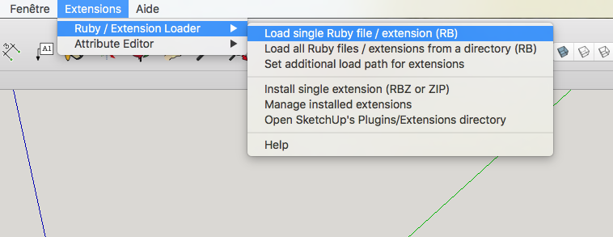
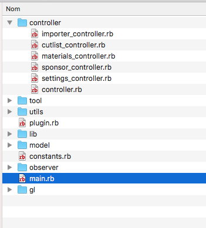

# Development Environment Setup Instructions

To be able to rebuild the plugin, you will first need to install a few tools. The plugin itself is written in **JavaScript** and **ruby**, but the distribution archive `dist/ladb_toolbox.rbz` is built by a **gulp** task.

The required tools and steps for successfully building this plugin are described hereafter.

## 1. Getting **Node.js** and **npm**

Download and install [Node.js](https://nodejs.org/en/download/) - *the asynchronous event driven JavaScript runtime*. This will include [npm](https://www.npmjs.com/) - *the package manager for JavaScript*.

Read this short note about [Installing Node](https://docs.npmjs.com/getting-started/installing-node) and make sure you have the latest version of **npm**:

``` bash
    $ node -v
    v10.15.3
    $ npm -v
    6.8.0
    $ npm install npm@latest -g
    $ npm -v
    6.9.0
```

On Windows you may also have to install `gulp-cli` to be able to run **gulp** from the command line:

``` bash
     $ npm install gulp-cli -g
```

## 2. Getting the Source Code

The best way to get project sources is to clone them from the GitHub repository. For that you need to have [Git](https://git-scm.com/) installed on your computer.
This is the preferred way, because updates will be easy to fetch and incorporate into your code.

Move to your project parent folder. Adapt it to your needs and environment.

``` bash
     $ cd /somewhere/on/your/computer
```

And clone the project from sources.

``` bash
     $ git clone git@github.com:lairdubois/lairdubois-opencutlist-sketchup-extension.git
```

Change to the project directory:

``` bash
     $ cd lairdubois-opencutlist-sketchup-extension
```

In the future, if you want to retrieve origin sources updates, just execute the git pull command from your project directory.
Caution, because if you have changed some files, this can generate conflicts that you will need to resolve.

``` bash
     $ git pull origin master
```

## 3. Installing Dependencies

From the project directory, change to the `build/` directory. We have placed a `package.json` file telling **npm** which dependencies to install. You may have to rerun this command after an update to the `package.json` file.

``` bash
    $ cd build
    $ npm install
```

## 4. Compiling Templates And Distribution Archive

Templates in the `src/ladb_opencutlist/(less|yaml|twig)` directories are compiled by a **gulp** task. If you change any of these files, you will need to recompile the templates:

``` bash
    $ cd build
    $ gulp compile
```

If you wish to build the archive [ladb_opencutlist.rbz](../dist/ladb_opencutlist.rbz), then:

``` bash
    $ cd build
    $ gulp build
```

If you wish to build the archive [ladb_opencutlist-dev.rbz](../dist/ladb_opencutlist-dev.rbz), then:

``` bash
    $ cd build
    $ gulp build --env=dev
```

The default behaviour of the **gulp** task (without argument) is to *compile* and then *build*.

## 5. Adding a New Language

Adding a new translation file is simple. Just add a new `.yml` file into the `src/yaml/i18n` directory by duplicating `fr.yml` (or any other file) and changing all the values into the desired language.
It is important to keep but to change the first key `_label` to the corresponding readable label or the new language.

After compiling the project (see 4.), your new language will appear in the **Preferences panel** of *OpenCutList*.

Note: this does **NOT** change the Sketchup language. It may even support a language not supported by Sketchup.

## 6. Run OpenCutList from Dev project folder

### Prerequist

> To avoid conflicts, you must not have a compiled OpenCutList (*.rbz) installed on you Skechup environment. 

In order to develop OpenCutList, you do not need to recompile the *.rbz archive each time you do changes. You can run OpenCutList directly from sources.
To do this, the first thing is to install the [AS On-Demand Ruby Extension](https://alexschreyer.net/projects/plugin-loader-for-sketchup/). This extension is not mendatory, but it will be simplier to load or reload ruby scripts.

### Launching

After installing AS On-Demand Ruby Extension, go to the **Extension** menu and select **Load Ruby / Extension** Loader and **Load single Ruby file / Extension**.



And just select `main.rb` from OpenCutList source folder.



And that's it. You can now play with OpenCutList.

### Reflect code changes

Sketchup loads ruby file and to not access them after. To reflect the changes to the ruby code, you must reload the files you changed. And if you change static or methods definitions, you need to restart Sketchup and process from scratch.

To reflect I18N (yaml) or UI (twig) changes you just need to run the `gulp compile` command and close and reopen the OpenCutList dialogue in Skechup.
